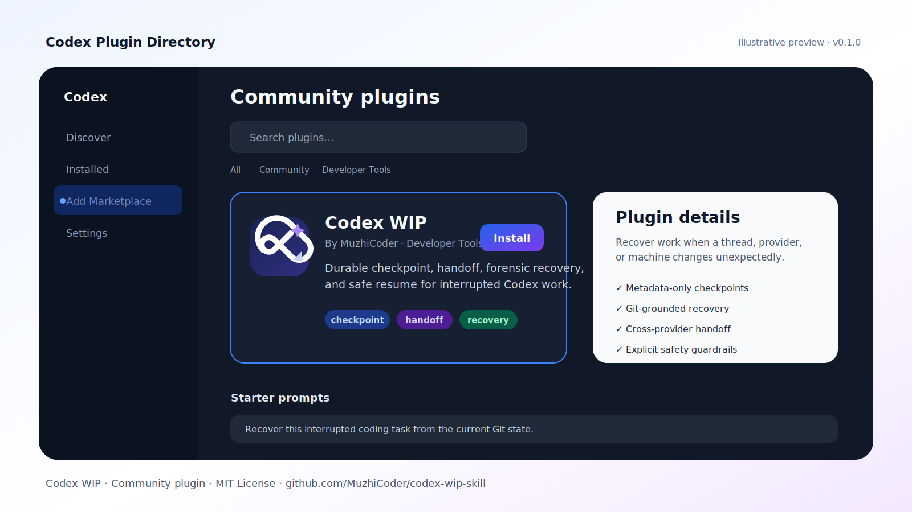
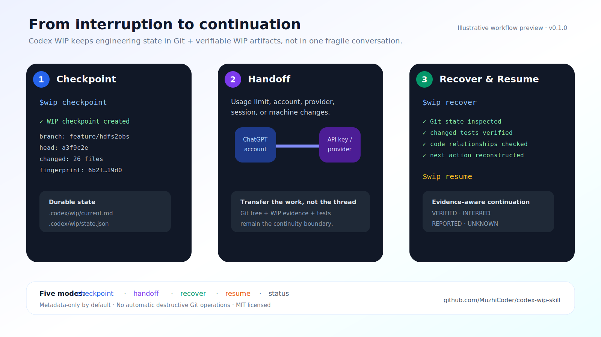

# Codex WIP Plugin

<p align="center">
  
</p>

<p align="center">
  <strong>Durable checkpoint · Handoff · Forensic recovery · Safe resume</strong>
</p>

<p align="center">
  <a href="https://github.com/MuzhiCoder/codex-wip-skill/releases/tag/v0.1.0"><strong>v0.1.0 Release</strong></a>
  ·
  <a href="https://muzhicoder.github.io/codex-wip-skill/"><strong>Live Demo</strong></a>
  ·
  <a href="https://github.com/openai/codex/issues/42725"><strong>Curated Marketplace Review</strong></a>
</p>

`codex-wip` packages the `$wip` continuity skill for Codex Plugin/Marketplace installation.

It helps preserve and recover long-running coding work across usage-limit exhaustion, provider/account changes, inaccessible conversations, crashes, context loss, and machine migration.

## Install from this marketplace

```bash
codex plugin marketplace add MuzhiCoder/codex-wip-skill --ref main
codex plugin add codex-wip@codex-wip-skill
```

Start a new Codex thread after installation, then try:

```text
$wip status
```

Core modes:

- `$wip checkpoint`
- `$wip handoff`
- `$wip recover`
- `$wip resume`
- `$wip status`

## Plugin Directory previews

The following images are illustrative product previews used by the Codex plugin manifest. They are generated from versioned SVG sources under `assets/source/` so the branding assets remain reproducible.





## Branding assets

- Logo: `assets/logo.svg`
- Composer icon: `assets/composer-icon.svg`
- Plugin Directory preview: `assets/plugin-directory.png`
- Workflow preview: `assets/workflow-overview.png`

License: MIT

Release: https://github.com/MuzhiCoder/codex-wip-skill/releases/tag/v0.1.0

Homepage: https://muzhicoder.github.io/codex-wip-skill/
